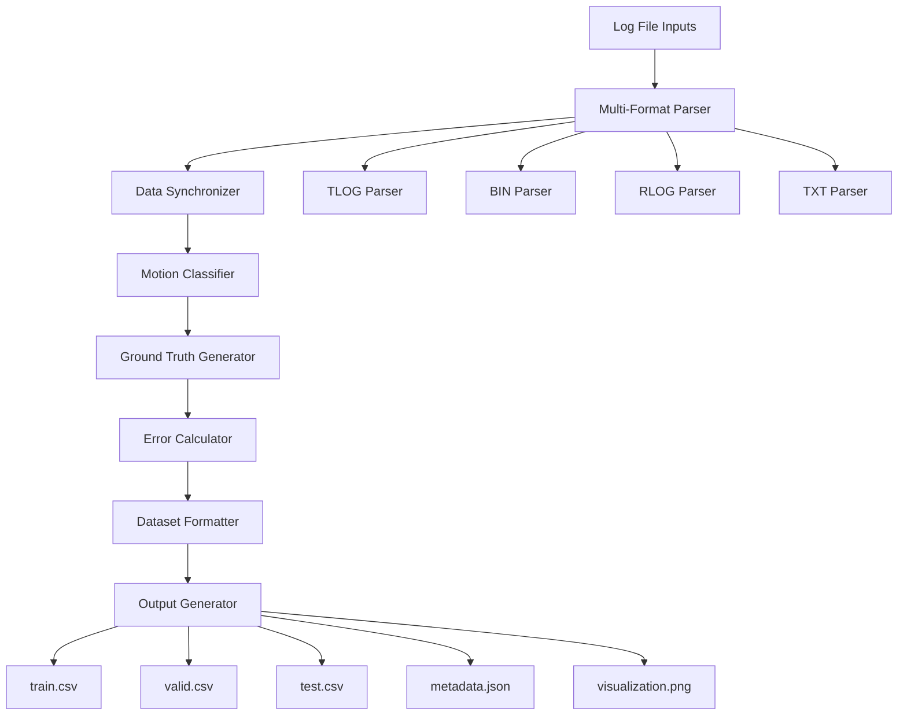

# Design Document

## Overview

The UAV Log Processor is a Python-based system that transforms multiple UAV log formats into machine learning-ready datasets for TCN training. The system follows a modular pipeline architecture with distinct phases for parsing, synchronization, ground-truth generation, error calculation, and dataset preparation.

## Architecture

The system uses a pipeline architecture with the following main components:



### Data Flow Example


## Components and Interfaces

### 1. Multi-Format Parser

**Purpose:** Extract structured data from various UAV log formats

**Interface:**
```python
class LogParser:
    def parse_tlog(self, file_path: str) -> DataFrame
    def parse_bin(self, file_path: str) -> DataFrame
    def parse_rlog(self, file_path: str) -> DataFrame
    def parse_txt(self, file_path: str) -> DataFrame
```

**Implementation Details:**
- Uses pymavlink for .tlog and .bin parsing
- Custom parsers for .rlog and .txt formats
- Extracts GPS_RAW_INT, GLOBAL_POSITION_INT, IMU_RAW, ATTITUDE messages
- Handles ArduPilot and PX4 message variations

### 2. Data Synchronizer

**Purpose:** Align all sensor streams to uniform timestamps

**Interface:**
```python
class DataSynchronizer:
    def synchronize_streams(self, data_streams: Dict[str, DataFrame]) -> DataFrame
    def interpolate_missing(self, df: DataFrame, target_freq: float) -> DataFrame
    def convert_coordinates(self, df: DataFrame, home_point: Tuple[float, float, float]) -> DataFrame
```

**Implementation Details:**
- Resamples all streams to 15 Hz target rate using pandas resample
- Timestamps are aligned using the earliest common start time and truncated to the shortest stream duration to avoid extrapolation
- Linear interpolation for missing values
- WGS84 to ENU coordinate conversion using pyproj
- Drops periods with >50% missing critical data

### 3. Motion Classifier

**Purpose:** Identify stationary vs moving flight segments

**Interface:**
```python
class MotionClassifier:
    def classify_motion(self, imu_data: DataFrame, 
                       accel_threshold: float = 0.5,
                       gyro_threshold: float = 0.1) -> Series
    def get_stationary_segments(self, motion_labels: Series) -> List[Tuple[int, int]]
```

**Implementation Details:**
- Calculates acceleration magnitude: sqrt(ax² + ay² + az²)
- Calculates gyroscope magnitude: sqrt(gx² + gy² + gz²)
- Uses sliding window (5 seconds) for noise reduction
- Labels as stationary when both thresholds are below limits

### 4. Ground Truth Generator

**Purpose:** Create corrected position estimates using sensor fusion

**Interface:**
```python
class GroundTruthGenerator:
    def generate_ground_truth(self, gps_data: DataFrame, 
                            imu_data: DataFrame, 
                            motion_segments: List) -> DataFrame
    def integrate_velocity(self, imu_data: DataFrame, dt: float) -> DataFrame
    def apply_drift_correction(self, positions: DataFrame, anchors: Dict) -> DataFrame
```

**Implementation Details:**
- Anchors ground truth at stationary segment means (or RTK/high-confidence GPS segments when available)
- Uses IMU velocity integration between anchors with drift correction: position(t) = anchor_pos + ∫velocity_imu(τ)dτ from anchor_time to t
- Applies Extended Kalman Filter (EKF) or complementary filter for sensor fusion
- Resets velocity integration at each stationary anchor to prevent drift accumulation
- Smooths transitions using cubic spline interpolation

### 5. Error Calculator

**Purpose:** Compute GPS error vectors for TCN training targets

**Interface:**
```python
class ErrorCalculator:
    def calculate_errors(self, gps_positions: DataFrame, 
                        ground_truth: DataFrame) -> DataFrame
    def compute_error_statistics(self, errors: DataFrame) -> Dict
```

**Implementation Details:**
- Calculates per-axis errors: error_x = gps_x - truth_x
- Computes error magnitude: sqrt(error_x² + error_y² + error_z²)
- Generates error statistics for validation

### 6. Dataset Formatter

**Purpose:** Structure data for machine learning consumption

**Interface:**
```python
class DatasetFormatter:
    def format_features(self, synchronized_data: DataFrame) -> DataFrame
    def normalize_features(self, df: DataFrame) -> Tuple[DataFrame, Dict]
    def split_dataset(self, df: DataFrame, 
                     train_ratio: float = 0.7,
                     val_ratio: float = 0.15) -> Tuple[DataFrame, DataFrame, DataFrame]
```

**Implementation Details:**
- Standardizes column names and order
- Z-score normalization for continuous features
- Sequential splitting to maintain temporal order
- Ensures no overlap between splits

## Data Models

### Synchronized Data Schema
```python
@dataclass
class SynchronizedRecord:
    timestamp: float
    gps_x: float
    gps_y: float  
    gps_z: float
    imu_ax: float
    imu_ay: float
    imu_az: float
    imu_gx: float
    imu_gy: float
    imu_gz: float
    velocity_x: float
    velocity_y: float
    velocity_z: float
    hdop: float
    vdop: float
    fix_type: int
    ground_truth_x: float
    ground_truth_y: float
    ground_truth_z: float
    gps_error_x: float
    gps_error_y: float
    gps_error_z: float
    gps_error_norm: float
```

### Configuration Schema
```python
@dataclass
class ProcessingConfig:
    target_frequency: float = 15.0  # Hz
    accel_threshold: float = 0.5    # m/s²
    gyro_threshold: float = 0.1     # rad/s
    min_stationary_duration: float = 3.0  # seconds
    interpolation_method: str = "linear"
    coordinate_system: str = "ENU"
```

## Error Handling

### Data Quality Issues
- **Missing GPS Fix:** Skip periods with fix_type < 3
- **IMU Sensor Failures:** Use backup sensors if available
- **Timestamp Gaps:** Interpolate gaps < 1 second, skip larger gaps
- **Coordinate Conversion Errors:** Log warnings and use fallback methods

### File Format Issues
- **Corrupted Log Files:** Attempt partial recovery, log errors
- **Unsupported Versions:** Graceful degradation with warnings
- **Missing Message Types:** Continue processing with available data

### Processing Errors
- **Memory Limitations:** Process in chunks for large files
- **Numerical Instability:** Use robust algorithms with error bounds
- **Invalid Configurations:** Validate inputs and provide defaults

## Testing Strategy

### Unit Tests
- Individual parser validation with sample log files
- Coordinate conversion accuracy tests
- Motion classification threshold validation
- Error calculation correctness verification

### Integration Tests
- End-to-end pipeline with real flight data
- Multi-format processing validation
- Dataset split consistency checks
- Output format compliance verification

### Performance Tests
- Large file processing benchmarks using concurrent.futures for multi-flight datasets
- Memory usage profiling with chunked processing via dask
- Processing time optimization with pyarrow for fast I/O operations
- Concurrent file handling validation

### Data Quality Tests
- Ground truth accuracy validation
- Error distribution analysis
- Temporal consistency verification
- Cross-validation with known trajectories

## Dependencies

### Core Libraries
- **pandas**: Data manipulation and analysis
- **numpy**: Numerical computations
- **pymavlink**: MAVLink message parsing
- **pyproj**: Coordinate system transformations
- **scipy**: Signal processing and interpolation

### Visualization
- **matplotlib**: Trajectory plotting
- **seaborn**: Statistical visualizations

### Machine Learning
- **scikit-learn**: Data preprocessing utilities
- **joblib**: Efficient data serialization

### File I/O
- **h5py**: HDF5 file handling (optional)
- **pyarrow**: Efficient CSV operations